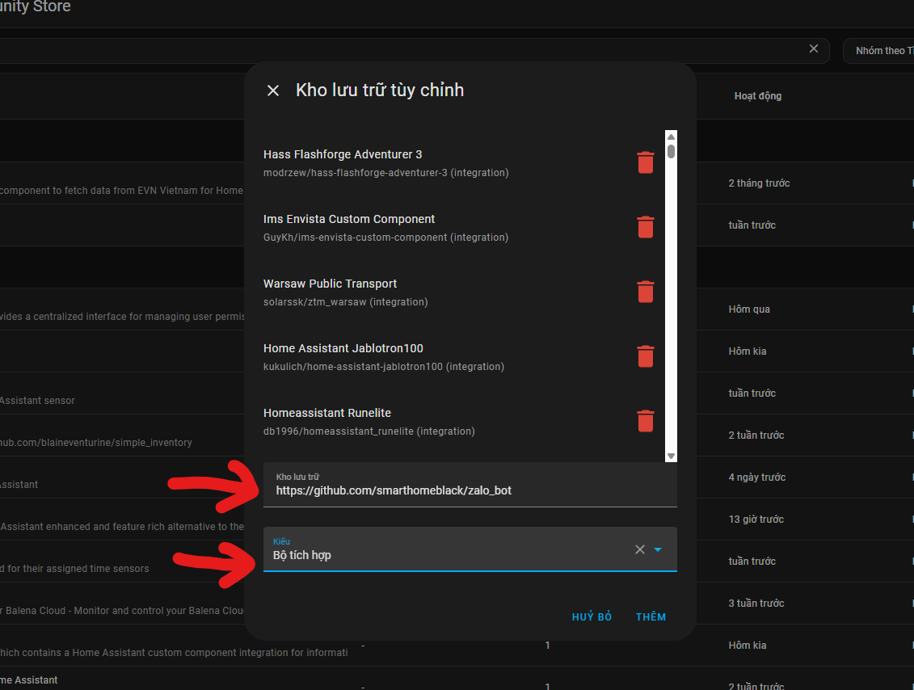
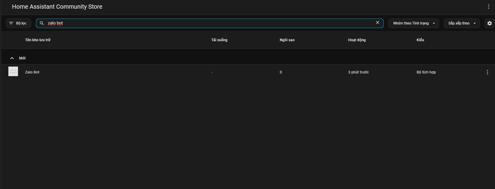

# Zalo Bot cho Home Assistant

## Giới thiệu

Dự án này cung cấp một bot Zalo tích hợp cho Home Assistant, giúp bạn gửi, nhận thông báo và điều khiển thiết bị qua Zalo một cách tiện lợi.

## Tính năng
- Nhận thông báo từ Home Assistant qua Zalo
- Điều khiển thiết bị Home Assistant bằng tin nhắn Zalo
- Yêu cầu đã cài đặt Addon Zalo Bot

## Hướng dẫn cài đặt

### 1. Thêm repo vào HACS

Vào HACS > Integrations > Ba chấm góc phải > Custom repositories, thêm đường dẫn repo:
```
https://github.com/smarthomeblack/zalo_bot
```
Chọn loại: Integration.



### 2. Cài đặt và cấu hình bộ tích hợp

Sau khi thêm repo, tìm kiếm "Zalo Bot" trong HACS và cài đặt.

Vào Cài đặt > Thiết bị & Dịch vụ > Thêm tích hợp mới > Chọn "Zalo Bot" và cấu hình theo hướng dẫn.



### 3. Cài đặt thủ công

Nếu không sử dụng HACS, bạn có thể cài đặt thủ công như sau:

1. Tải mã nguồn repo này về máy.
2. Sao chép thư mục `custom_components/zalo_bot` vào thư mục `custom_components` trong thư mục cấu hình Home Assistant của bạn.
3. Khởi động lại Home Assistant.
4. Vào Cài đặt > Thiết bị & Dịch vụ > Thêm tích hợp mới > Chọn "Zalo Bot" và cấu hình theo hướng dẫn.

## Đóng góp
Mọi đóng góp, báo lỗi hoặc ý tưởng mới đều được hoan nghênh qua GitHub Issues hoặc Pull Request.

---

**Chúc bạn trải nghiệm vui vẻ với Zalo Bot cho Home Assistant!**
